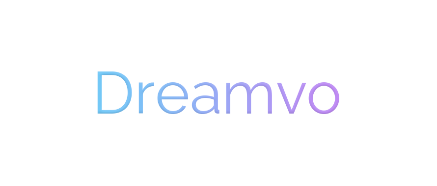
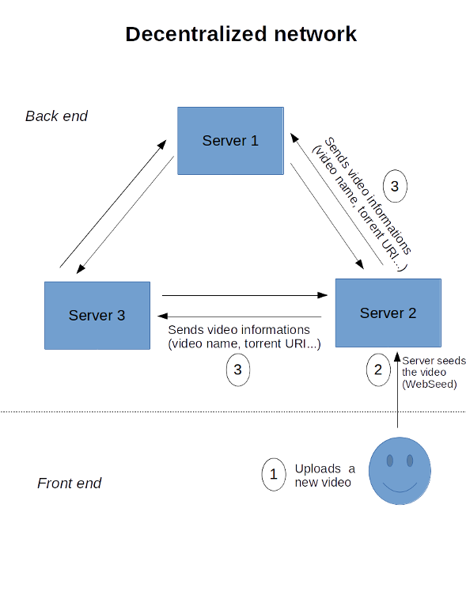
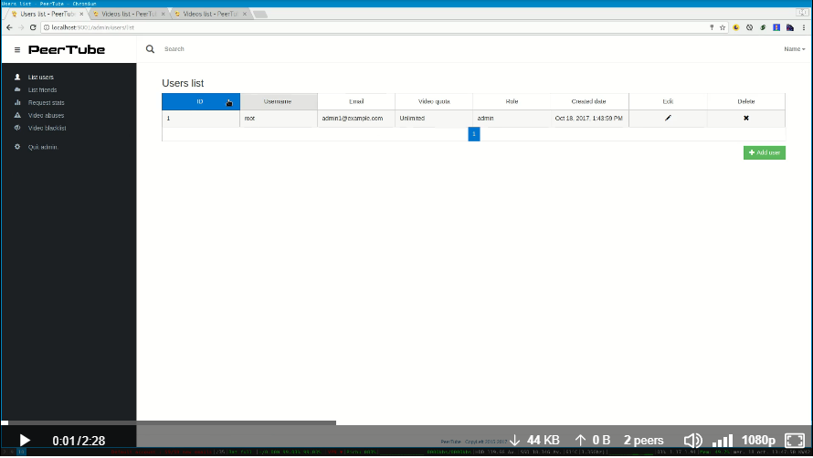

 Temporary logo

# Dreamvo
Dreamvo is a free and open source decentralized video platform project. The project aims to create an alternative to YouTube that offers another vision of sharing, viewing and managing its audiovisual content on the web.

## Decentralization, the future of video sharing?
The principle of decentralization is based on the possibility of user contribution. In this context, decentralizing videos avoids spending huge sums on servers and taking advantage of the power of the P2P network.

<a href="https://github.com/Chocobozzz/PeerTube">PeerTube</a> is a decentralized video platform sponsored by Framasoft, a non-profit organization that promotes, disseminates and develops free culture in general and free software. The aim of the PeerTube project is to propose an alternative to YouTube by creating a network of decentralized platforms, free and open source. It is on this project that we want to base Dreamvo. We want to be among the first platforms to democratize decentralized video sharing.

The problem that PeerTube wanted to raise is that we can not create video streaming alternatives <a href="https://en.wikipedia.org/wiki/Free_and_open-source_software">FOSS</a> to YouTube, Dailymotion, Vimeo... with a centralized software. An organization alone may not have enough money to pay for the bandwidth and video storage needed for such a project.

So we need a decentralized server network that <a href="https://www.quora.com/What-are-seeds-peers-and-leeches-in-Torrents-language">seeds</a> videos (like Diaspora for example). But that's not enough because a video could become famous and overload the server. That's why we need to use a P2P protocol to limit the server load. Thanks to WebTorrent, we can do P2P directly in the web browser. This means that a user can watch a video just by looking at it from their browser, it's like sharing the video stream you're downloading by watching a video on YouTube to someone else watching the same video at the same time. Even if no one watches a video, it remains accessible via the main server via the <a href="http://getright.com/seedtorrent.html">WebSeed protocol</a>. Decentralization also makes it possible to migrate to another platform without having to re-upload all of its videos since they are already available for import from the P2P network.

Currently, PeerTube is still in development but contains many features that are usually found as subtitles, an NSFW content detection algorithm, the ability to integrate the HTML5 player as well as many basic features we can find on YouTube. PeerTube is not yet ready to be deployed in a production environment, but it should be ready in the coming months.

## A suitable business model
Develop a solid business model is important. It's necessary to generate profit but also to pay the creators of contents, avoiding the recourse to ads. What if the user could also contribute financially to the development of the platform? The <a href="https://medium.com/precoil/what-is-the-business-model-for-a-twitch-streamer-f3b9e5351666">Twitch business model</a> is based on subscriptions. Channels that meet on certain criteria are eligible for a partnership with Twitch which allows them to enable the paid subscription of 4.99 € per month.

This partnership give the following advantages :
* Get a part of the ads revenues generated by videos on the channel
* Enable the paid subscription
* Creating a custom goodies store
* Enable bits donations

====

Twitch recovers a percentage of revenue generated by subscriptions, and subscribers have certain benefits such as personalized chat emoticons, badges, privileged access to past broadcast or certain sites. With traffic, ads that non-subscribers watch, Twitch Turbo subscriptions ($ 8.99 / month) and channel subscriber fees, Twitch generates hundreds of millions of dollars every year. Spectators financially support their favorite creators while supporting the platform

Another example, <a href="https://www.feedough.com/reddit-make-money-reddit-business-model/"> Reddit </a>. Reddit is a discussion forum whose business model is based on advertising (links / posts sponsored by users or by Google Adsense) but also on their premium subscription "Reddit Gold" ($ 3.99 or $ 29.99 / month) which gives certain advantages: disable ads (users can turn off ads when they want), a higher per page comment quota, save and rank comments where the user can save the comment he / she likes and can rate them according to their own needs, access custom themes provided by Reddit. In addition, Reddit Gold members can upgrade standard members into Gold members in one click with a certain limit.

These models are interesting and adapted to such a project, but there is a problem: How to convince the audience to migrate to a new platform knowing that they will have to pay to support their favorite videographers because advertising, being less present, will bring back less money? We believe that the answer lies in the solutions that we offer to videographers and their community, namely more flexible copyright rules, better content management, better contact with their community, a platform that evolves with its community as well as many features to enhance each user's experience.

 <a href="https://twitter.com/_Amixem/status/953612321707917312">Tweet original</a>

"Youtube monetization since early January is divided by 4, I will soon have to open a tipee to pay my gasoline 😜.In truth it's shit and for small channels it's catastrophic.Imagine that your salary goes from 1000 € to 300 € overnight ..."

## Take back power with a healthy business model

With YouTube's current business model, it's the advertisers who have the power over the remuneration of content creators. This is very bad because because of controversies like the one around the YouTuber Logan Paul for example, the advertisers are shown more reluctant towards YouTube, because they do not want their image to be assimilated as being in agreement with this type of content. YouTube is therefore obliged to lower the thresholds of monetization and to restrict access to it with more precise criteria. This is one of the main reasons why YouTube is becoming obsolete. The community must regain power at the expense of advertisers.

## Why "Dreamvo" ?

For Anglophones, "Dreamvo" refers to the possibility of recording a dream for a future vision, when a dream is so nice that you want to record it and see it again. It's also a subtle wink to <a href="https://github.com/dreamvids"> DreamVids </a>, a French startup that was planning to compete with YouTube, and who realized the exploit to prove that it is possible. The platform closed at the end of 2015 after a hardware problem on the part of their host, they had planned to relaunch it with a version V3, she never saw the day. This new platform, in addition to being decentralized and open source, will provide creators and viewers with a tool that truly meets their needs.

The mains goals of Dreamvo are :

- A better respect of the private life with anonymous accounts and the encryption with [public key] (https://www.globalsign.fr/fr/centre-information-ssl/cryptographie-cle-publique/)
- A thought platform [secure by default] (https://en.wikipedia.org/wiki/Secure_by_default)
- Innovative features allowing better interactions with the community- An economic model largely based on donations and subscriptions
- Put more forward quality content and novelty
  
## An ambitious but achievable project
Although the project may seem unrealistic or too ambitious, we think we should not burn steps. The general public may not be ready to get rid of YouTube, but it will come sooner or later, like it or not, and nothing prevents us to create an alternative to it and develop a YouTube best little on a small scale, without spending a lot of money on servers or marketing. The first goal is to launch a solution for all those who are directly impacted by the current YouTube policy, its main flaws, namely copyrights, censorship and monetization.

# Contribute
You are a developer, a journalist, a programmer, a video artist or a simple spectator? You all have the power to contribute to the development of this platform, you do not need to know how to code to contribute! <a href="https://github.com/Chocobozzz/PeerTube/blob/develop/.github/CONTRIBUTING.md"> More info </a>

But above all, we are looking for developers to compose a team. We are looking for a UX / UI web designer, front and back developers, as well as one or more sysadmins.

Send a developer application: *raphael@crvx.fr
